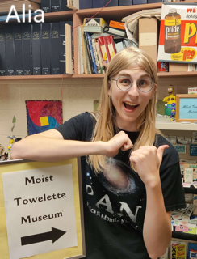

# Teachers and Grading

## Lecture

| Meetings           |                       |                    | Location                                                                     |
| ------------------ | --------------------- | ------------------ | ---------------------------------------------------------------------------- |
| Monday 3:00-3:50pm | Wednesday 3:00-3:50pm | Friday 3:00-3:50pm | Plant & Soil Science Bldg A149 and [Zoom](https://msu.zoom.us/j/93683330722) |

- [Zoom Link](https://msu.zoom.us/j/93683330722) (_Passcode is pinned in our Slack workspace._)

## Professor

| Instructor                  | Email            | Office                                                                                                |
| --------------------------- | ---------------- | ----------------------------------------------------------------------------------------------------- |
| _Danny Caballero (he/they)_ | caball14@msu.edu | MWF? [BPS 1310A](http://tinyurl.com/dc-bps-office); TTh? [EGR 1515](http://tinyurl.com/dc-egr-office) |

| Office Hours                                                                            |
| --------------------------------------------------------------------------------------- |
| Monday/Wednesday/Friday 4-5:00pm or [schedule me](https://cal.com/dannycaballero/15min) |

Danny will lead the course, design the homework and exams, and assign final grades. Danny is also responsible for the course content, so if you have any suggestions for how to improve the course, please let him know. Danny will also grade your midterm and final projects.

## Graduate Teaching Assistant

| Homework Grader  | Email            |
| ---------------- | ---------------- |
| _Josh Nicholson_ | nicho732@msu.edu |

Josh will be grading your homework assignments. He is split between our course and another one, so his homework grading wil be coarsely grained. Josh will provide overall feedback on the things that students struggled with on homework sets; that will be shared in class. If you have questions about your homework grade, please contact Josh directly.

## Undergraduate Learning Assistants

| Learning Assistant         | Email            | Office Hour | Zoom Link |
| -------------------------- | ---------------- | ----------- | --------- |
| _Alia Valentine (she/her)_ | valen176@msu.edu | TBD         | TBD       |
| _Addy Shaska (they/them)_    | shaskaad@msu.edu | TBD         | TBD       |

Alia and Addy will be helping you in class and in office hours. They have taken this course previously and have been selected because they are passionate about helping you learn classical mechanics. They are both incredible resources for you. They will offer two hours of office hours per week, and they will be available on Fridays in class and on Slack.

## Getting Help

PHY 321 is a very challenging course. It introduces many new concepts and mathematical techniques that may be unfamiliar to you. It is important that you seek help when you need it. We are here to help support your understanding. There are many resources available to you:

- **Office hours:** You are encouraged to attend office hours to get help with homework, projects, or any other questions you have about the course. You can also [schedule a meeting](https://cal.com/dannycaballero/15min) with Danny.
- **Slack:** We will use Slack for all course communication. You can use Slack to ask questions about homework, projects, or any other course-related questions. [Join our Slack workspace](https://join.slack.com/t/phy321msu-sp24/shared_invite/zt-2a1dtsspu-ARet8OqiS8PL6023g5SxlQ) and introduce yourself in the `#introductions` channel.
- **Your classmates** Physics is a social enterprise. We cannot progress in our understanding of science alone; that simply doesn't happen. We need to work together to make progress. You are encouraged to work together on homework, midterms, and the final.

## Grading and Dates

### Course Activities

| Activity                                                    | Percentage of total score |
| ----------------------------------------------------------- | ------------------------- |
| Homeworks, 9 in total and due Fridays the week after        | 20%                       |
| First Midterm Project, _due Friday Feb 23_                  | 25%                       |
| Second Midterm Project, _due Friday April 5_                | 25%                       |
| Final Exam project, _due Friday April 26_                   | 30%                       |
| Extra Credit Assignment, homework 10, (due Friday April 19) | 10%                       |

#### Homework Grading

Because of the large number of students in the course, homework grading will be coarsely grained. Josh will provide overall feedback on the things that students struggled with on homework sets; that will be shared in class. The homeworks will be graded on a 3 point scale: 3 points for a complete and correct solution, 2 points for a mostly complete/slightly incorrect solution, 1 point for an incorrect/incomplete solution, and 0 for a blank solution. 

This coarse grading scale works for each problem, regardless of their value. For example, if you have a problem worth 5 points and have a mostly complete solution you will earn $5 (\dfrac{2}{3}) = 3.33$ of the possible 5 points for that problem. If you have questions about your homework grade, please contact Josh directly.

### Grading scale

| **4.0** | **3.5** | **3.0** | **2.5** | **2.0** | **1.5** | **1.0** |
| ------- | ------- | ------- | ------- | ------- | ------- | ------- |
| 90%     | 80%     | 70%     | 60%     | 50%     | 40%     | 30%     |

### Extra Credit Opportunities

- Starting with Homework 3, there will be extra credit opportunities on each homework that are worth up to 5 additional points on the assignment. These involve attending research seminars and preparing a short write-up about the seminar. You can find the list of seminars on the [Physics and Astronomy Seminars and Colloquia Schedule](https://pa.msu.edu/news-events-seminars/index.aspx). More details about the extra credit opportunities will be posted on the homework assignments.
- For each midterm, there will be similar extra credit opportunities. These will be announced closer to the midterm dates, and they will be worth up to 10 additional points on the midterm.
- As indicated above, there will also be an extra credit assignment at the end of the semester that will be worth up to 10% on the final grade.

## Collaboration Policy

I strongly encourage you to work with your classmates on homework, projects, and the final. You are also encouraged to seek help from the professor, the GTA, and the learning assistants. However, you must write up your solutions independently. Copying someone else's work is a violation of the [Spartan Code of Honor Academic Pledge](https://spartanexperiences.msu.edu/about/handbook/spartan-code-of-honor-academic-pledge/index.html). This applies to all graded work in the course, including homework, projects, and the final. If you have any questions about this policy, please ask me.

### Generative AI Policy

This policy on collaboration extends to [generative AI](https://tech.msu.edu/about/guidelines-policies/generative-ai/). You are welcome to use generative AI tools (e.g. ChatGPT, Dall-e, etc.) in this class as doing so aligns with the course learning goals. These tools can be useful in gathering information, troubleshooting code, and developing potential directions. However, you are responsible for the information you submit based on an AI query (for instance, that it does not violate intellectual property laws, or contain misinformation or unethical content). Your use of AI tools must be properly documented and cited in order to stay within university policies on academic integrity and the [Spartan Code of Honor Academic Pledge](https://spartanexperiences.msu.edu/about/handbook/spartan-code-of-honor-academic-pledge/index.html).

For example, if generative AI is used to develop code or make sense of results, the original query, the resulting text, and your discussion of how that information was synthesized and used is required to be submitted with your work. This can be in an appendix if it distracts from the presentation of your work. Remember, AI is not likely to generate a response that would be seen as quality work and should be modified and improved. AI cannot think critically, so you must do that work. It produces incorrect and incomplete results. You need to demonstrate what you have learned in this class, not what AI can generate. More details or the rationale for this policy can be found here: https://msu-cmse-courses.github.io/cmse202-F23-jb/course_materials/CMSE202_GenerativeAI_Policy.html